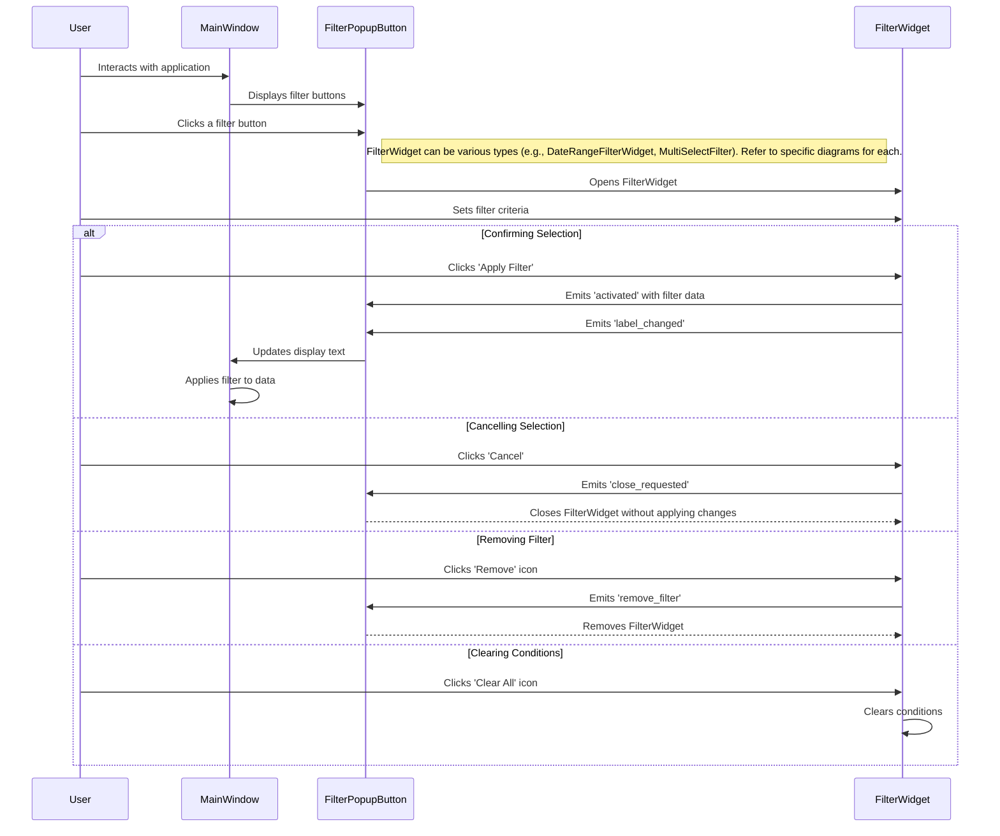
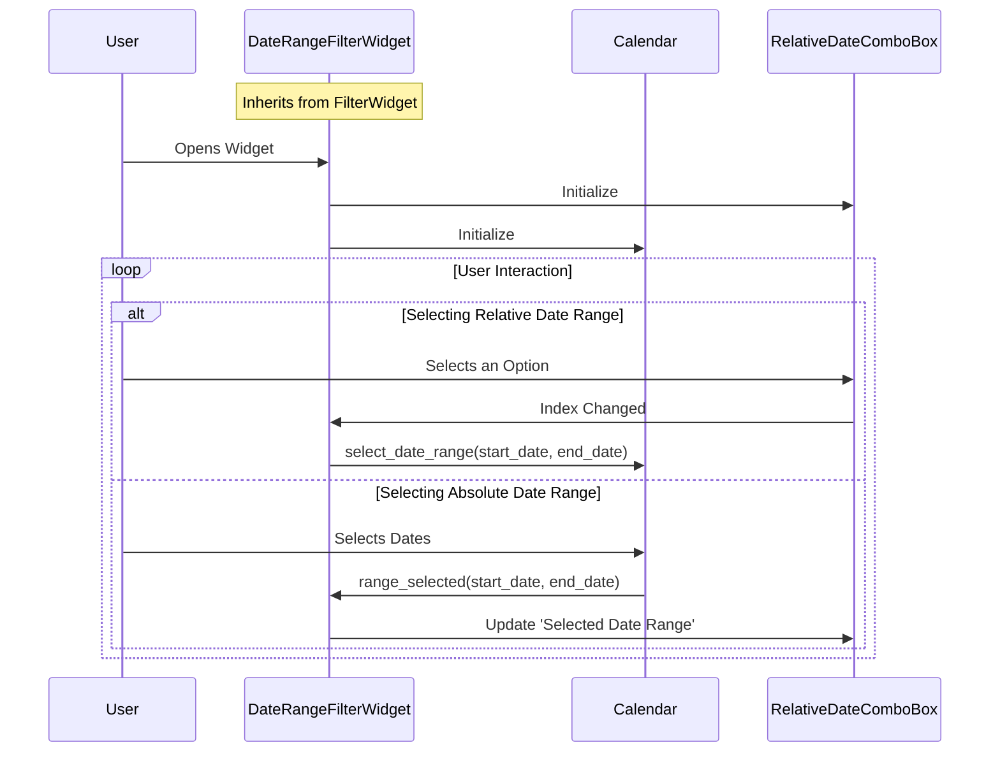
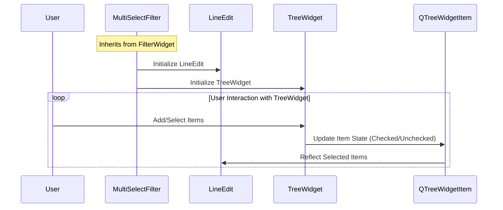

### Sequence Diagram Description

#### Actors and Components:
- **User**: The person interacting with the GUI.
- **Main Window**: The primary window of your application.
- **FilterPopupButton**: The button that triggers the filter widget.
- **FilterWidget**: The base class for filter widgets.
- **DateRangeFilterWidget**: A specialized filter widget for date ranges.
- **MultiSelectFilter**: A specialized filter widget for multi-selection.

#### Flow of Interaction:
1. **Opening the Filter Widget**:
   - The **User** interacts with the **Main Window** and clicks on a **FilterPopupButton**.
   - **FilterPopupButton** opens the corresponding **FilterWidget** (either **DateRangeFilterWidget** or **MultiSelectFilter**).

2. **Setting Filter Criteria**:
   - The **User** sets the filter criteria in the **FilterWidget**.

3. **User Actions in FilterWidget**:
   - **Confirming Selection**: If the **User** clicks 'Apply Filter', the **FilterWidget** emits an 'activated' signal with the filter data, and 'label_changed' signal to update the button's display text.
   - **Cancelling Selection**: If the **User** clicks 'Cancel', the **FilterWidget** emits a 'close_requested' signal, closing the widget without applying changes.
   - **Removing Filter**: If the **User** clicks the 'Remove' icon, the **FilterWidget** emits a 'remove_filter' signal, leading to the removal of the widget from the filter set.
   - **Clearing Conditions**: If the **User** clicks the 'Clear All' icon, the **FilterWidget** clears the current conditions within the widget.

4. **Updating the Main Window**:
   - **FilterPopupButton** receives these signals from the **FilterWidget**. Upon receiving the 'activated' signal, it updates its display text and informs the **Main Window**.
   - The **Main Window** listens to the 'activated' signal and applies the filter criteria to the data displayed.

---

### Sequence Diagram for Internal Interactions in `DateRangeFilterWidget`

### Sequence Diagram Description for `DateRangeFilterWidget`

#### Actors and Components:
- **User**: The individual who interacts with the `DateRangeFilterWidget`.
- **DateRangeFilterWidget**: A specific type of `FilterWidget` designed for selecting date ranges.
- **Calendar**: A component within the `DateRangeFilterWidget` that allows users to pick specific dates.
- **RelativeDateComboBox**: A dropdown component within `DateRangeFilterWidget` for selecting predefined relative date ranges.

#### Flow of Interaction:
1. **Widget Initialization**:
   - When the **User** opens the `DateRangeFilterWidget`, it initializes its components: the **RelativeDateComboBox** and the **Calendar**.

2. **User Interactions**:
   - **Selecting Relative Date Range**: 
     - The **User** selects an option from the **RelativeDateComboBox**.
     - The **RelativeDateComboBox** informs `DateRangeFilterWidget` of the index change.
     - `DateRangeFilterWidget` then updates the **Calendar** to reflect the selected start and end dates.
   - **Selecting Absolute Date Range**:
     - The **User** selects dates directly from the **Calendar**.
     - The **Calendar** sends the selected range back to the `DateRangeFilterWidget`.
     - `DateRangeFilterWidget` updates the **RelativeDateComboBox** to display the chosen 'Selected Date Range'.

3. **Processing User Input**:
   - Within the loop of user interaction, the `DateRangeFilterWidget` processes and reacts to the user's choices, ensuring that the selected date range is accurately captured and displayed across both the **Calendar** and the **RelativeDateComboBox**.

---

### Sequence Diagram Description for `MultiSelectFilter`

#### Actors and Components:
- **User**: The individual interacting with the `MultiSelectFilter`.
- **MultiSelectFilter**: Inherits from `FilterWidget` and represents a filter with a checkable tree.
- **LineEdit**: A component for displaying selected items.
- **TreeWidget**: A hierarchical tree structure for selecting multiple items.
- **QtWidgets.QTreeWidgetItem**: Represents individual items within the tree.

#### Flow of Interaction:
1. **Initialization**:
   - The `MultiSelectFilter` initializes, setting up the **LineEdit** and **TreeWidget**.
   - `TreeWidget` is configured with hidden headers and root decoration. Each tree item (from **QtWidgets.QTreeWidgetItem**) is made checkable.

2. **User Interaction with TreeWidget**:
   - **Adding Items**: The **User** can add sequences and shots to the tree. Each sequence becomes a parent item with shots as children.
   - **Selecting Items**: As the **User** checks or unchecks items, the `TreeWidget` updates the `LineEdit` with the selected items' names.

3. **Filter State Management**:
   - **Saving State**: When saving changes, the `MultiSelectFilter` captures the state of checked items and emits signals for label change and activation.
   - **Loading State**: On loading a previous state, the `MultiSelectFilter` restores the check states of the tree items as per the saved state.
   - **Discarding Changes**: If the user discards changes, the `MultiSelectFilter` reverts to the last saved state.

4. **Signal Emission**:
   - Upon selecting items and clicking 'Apply', `MultiSelectFilter` emits an 'activated' signal with the checked items.
   - If the label is changed, it emits a 'label_changed' signal.

