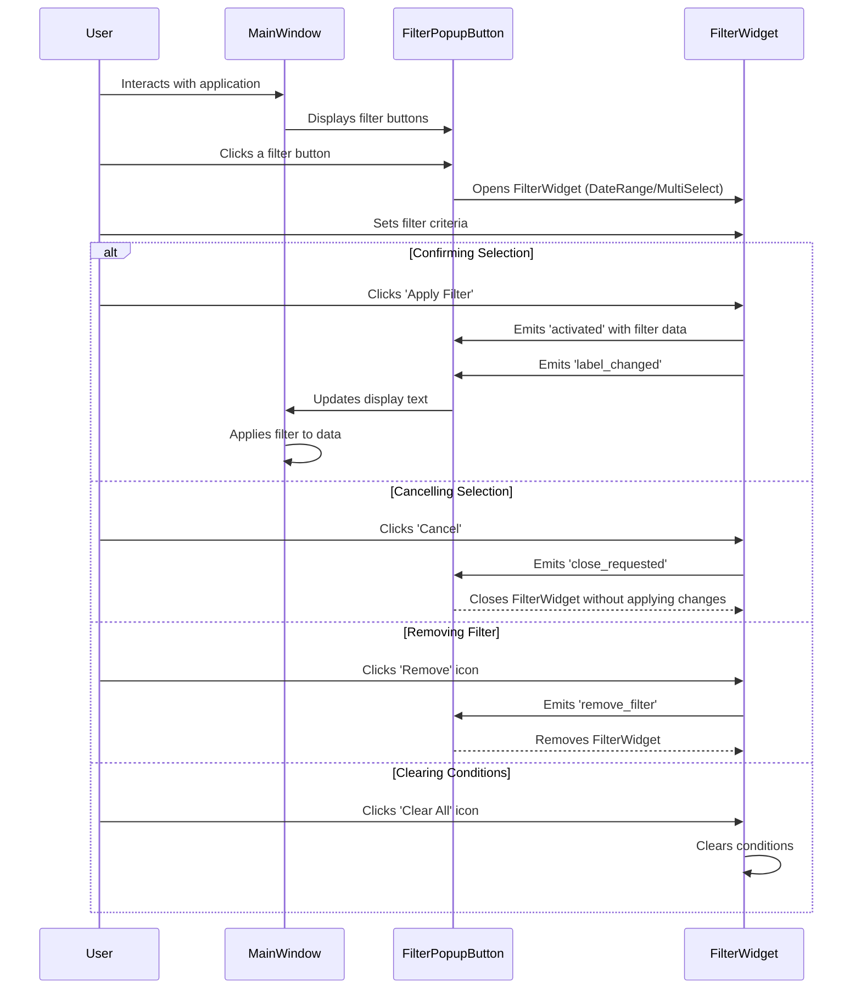

### Sequence Diagram Description

#### Actors and Components:
- **User**: The person interacting with the GUI.
- **Main Window**: The primary window of your application.
- **FilterPopupButton**: The button that triggers the filter widget.
- **FilterWidget**: The base class for filter widgets.
- **DateRangeFilterWidget**: A specialized filter widget for date ranges.
- **MultiSelectFilter**: A specialized filter widget for multi-selection.

#### Flow of Interaction:
1. **Opening the Filter Widget**:
   - The **User** interacts with the **Main Window** and clicks on a **FilterPopupButton**.
   - **FilterPopupButton** opens the corresponding **FilterWidget** (either **DateRangeFilterWidget** or **MultiSelectFilter**).

2. **Setting Filter Criteria**:
   - The **User** sets the filter criteria in the **FilterWidget**.

3. **User Actions in FilterWidget**:
   - **Confirming Selection**: If the **User** clicks 'Apply Filter', the **FilterWidget** emits an 'activated' signal with the filter data, and 'label_changed' signal to update the button's display text.
   - **Cancelling Selection**: If the **User** clicks 'Cancel', the **FilterWidget** emits a 'close_requested' signal, closing the widget without applying changes.
   - **Removing Filter**: If the **User** clicks the 'Remove' icon, the **FilterWidget** emits a 'remove_filter' signal, leading to the removal of the widget from the filter set.
   - **Clearing Conditions**: If the **User** clicks the 'Clear All' icon, the **FilterWidget** clears the current conditions within the widget.

4. **Updating the Main Window**:
   - **FilterPopupButton** receives these signals from the **FilterWidget**. Upon receiving the 'activated' signal, it updates its display text and informs the **Main Window**.
   - The **Main Window** listens to the 'activated' signal and applies the filter criteria to the data displayed.
